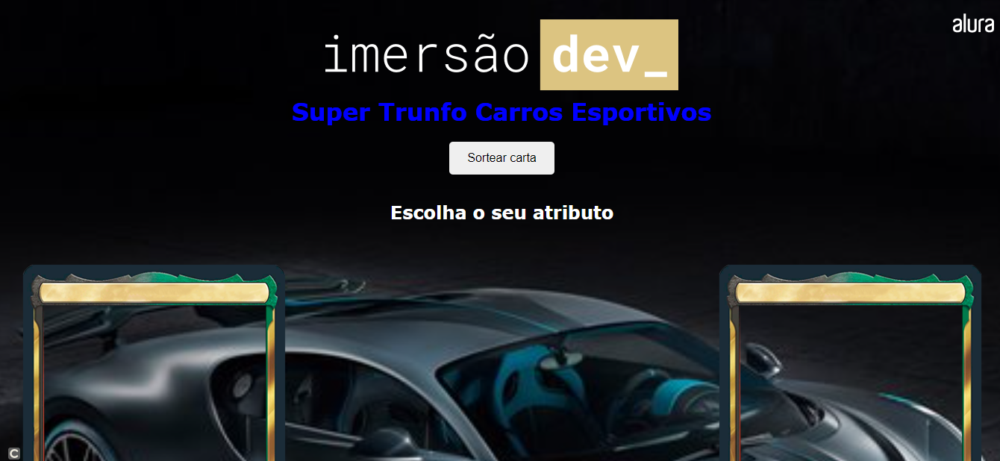

Jogo de carta super trunfo desenvolvido durante o sétimo e oitavo dia de Imersão Dev da Alura. Como tema do jogo escolhi fazer sobre carros esportivos colocando três atributos nas cartas: velocidade, design e potência do carro. Porém ainda tem alguns bugs o jogo e futuramente irei melhorar o jogo e deixar ele funcionando como esperado.

Tecnologias usadas: HTML5, CSS3 e JavaScript

